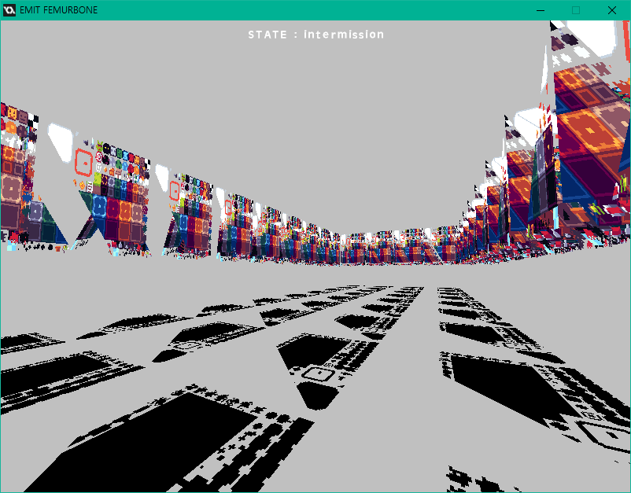
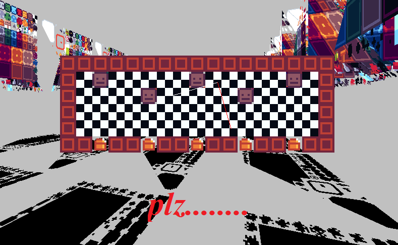
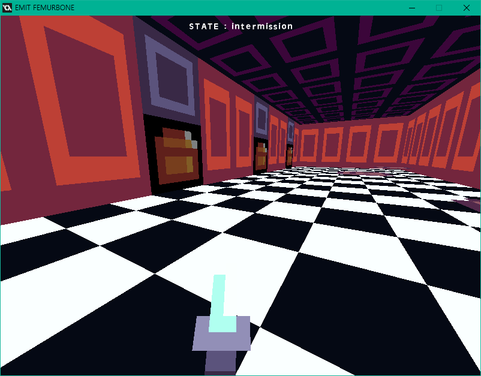
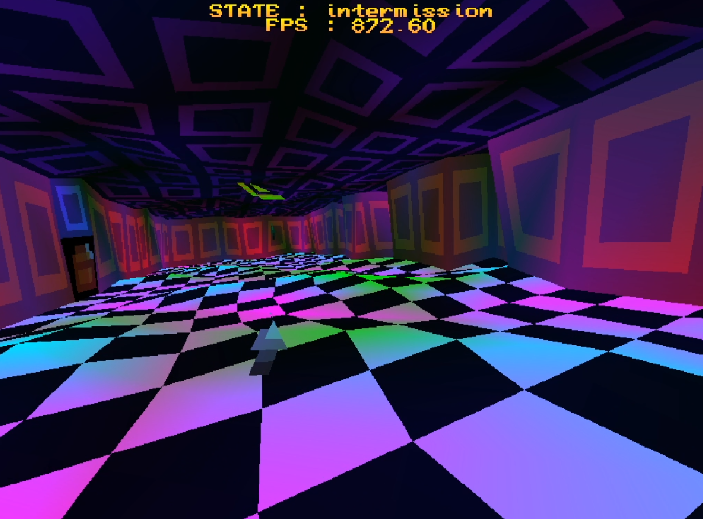

# :hocho: VAN GOGH FEMURBONE EJECTION ANECDOTE : SOURCE CODE :hocho:

### A source code of my psuedo-roguelike swordfighting game entry for [Badduck and Eli's epic game jam](https://itch.io/jam/badducks-and-elis-epic-game-jam), written in 48 hours over the span of a weekend in 2020, July.
### See the game's itch.io page HERE : [zikbakguru.itch.io/van-gogh-femurbone-eject](https://zikbakguru.itch.io/van-gogh-femurbone-eject)

## The game features...
* Retro-looking downscaling effect
* 3D camera that supports pitch, yaw, roll rotation
* Procedurally generated weapons & enemies
* Randomly generated room names that completely makes no sense
* Rooms that gets randomly 'selected' from internal list of rooms that is represented by array of strings
* Building mesh / vertex buffer that can be passed to GPU for rendering from given map / tilemap data
* Billboard graphics
* Somewhat in-depth swordfighting system that features parrying
* Retro sfx & music that was synthesized and composed by myself

## Also included : the project files for my sound effects and music.
They're conveniently placed inside of `/SFX` and `/MUS` folder respectively. The sound effect file (`.lch` files) can be opened with sfx synthesizer [LabChirp](https://labbed.itch.io/labchirp), And the music file (`loop1.kt` file) can be opened with music tracker [Klystrack](https://kometbomb.itch.io/klystrack).

## Warning : Since this build is the exact same build as the gamejam build, This game contains a glitch that causes crash, keep that in mind.

## Credits
* The graphics asset were made & provided by Eli, The game jam's rules/restrictions was that we're only permitted to use the assets provided. (but drawing things like texts, shapes etc was allowed)
* The font : Font from  Armin Gessert's The Great Giana Sisters (Game for Commodore 64), Converted to TTF font by KreativeKorp : www.kreativekorp.com/software/fonts/c64.shtml

## License
* [The game's code (including the shader code) is licensed with custom license (basically it has no license asdf)](LICENSE.txt)

## Developement progress & misc. footages

## (See the twitter thread with full development progress from start to finish : [twitter.com/ZIKBAKGURI/status/1279203901623787520](https://twitter.com/ZIKBAKGURI/status/1279203901623787520))